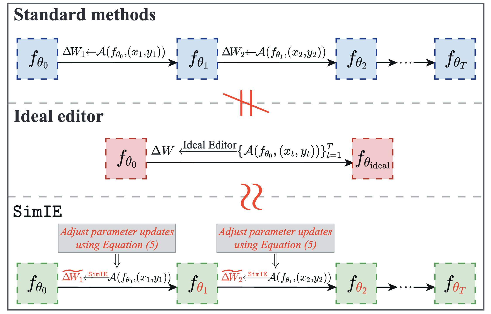

# Towards Lifelong Model Editing via Simulating Ideal Editor
This repository provides a PyTorch implementation of the ICML 2025 paper [Towards Lifelong Model Editing via Simulating Ideal Editor](https://icml.cc/virtual/2025/poster/45062). This paper proposes a general framework that restores the strong performance of standard model editing methods in a lifelong context, bridging the gap between these two paradigms for the first time.



## Requirements
Our implementation is based on [EasyEdit](https://github.com/zjunlp/EasyEdit), specifically simplified for lifelong model editing scenarios. It is built with Python 3.9, PyTorch 2.1, and CUDA 12.1. To get started, please install the required dependencies by running the following command:
```bash
conda create -n simie python=3.9.7
pip install -r requirements.txt
```

## How to Run

### 1. Prepare the dataset
The datasets used in the paper are from [ROME](https://arxiv.org/pdf/2202.05262) and [WISE](https://arxiv.org/pdf/2405.14768). To avoid external links, we provide the datasets in the `data` folder, where `*-edit.json` are used for editing.

### 2. Prepare the pre-trained model
Pre-trained models can be downloaded from [HuggingFace](https://huggingface.co/models). We provide a Python script `download_pretrained.py` to help download pre-trained models, including LLaMA-2, Mistral, and GPT2-XL. The models will be stored in the `hugging_cache` folder.

### 3. Configuration
To replicate the experimental results, hyperparameter configurations for each algorithm can be found in the `hparams` folder. These configurations are copied from [EasyEdit](https://github.com/zjunlp/EasyEdit).

### 4. Run the experiments
- To run the experiments, use the following command:
    ```bash
    python main_lifelong.py --editing_method <editing_method> --model_name <model_name> --data_type <data_type>
    ```
- The standard methods can be enhanced using the proposed SimIE, by adding the `--simIE` flag:
    ```bash
    python main_lifelong.py --editing_method <editing_method> --model_name <model_name> --data_type <data_type> --simIE
    ```
- **Example:** To run MEMIT using ZsRE to edit LLaMA-2, and enhance it with the proposed SimIE with the hyperparameter $\lambda=10$, use the following command:
    ```bash
    python main_lifelong.py --editing_method MEMIT --model_name llama-7b --data_type ZsRE --simIE --lamHyper 10
    ```

## Citation
Please consider citing our paper as:
```
@InProceedings{guo2025towards,
  title = 	 {Towards Lifelong Model Editing via Simulating Ideal Editor},
  author =       {Guo, Yaming and Guo, Siyang and Zhu, Hengshu and Sun, Ying},
  booktitle = 	 {Proceedings of the 42th International Conference on Machine Learning},
  year = 	 {2025}
}
```