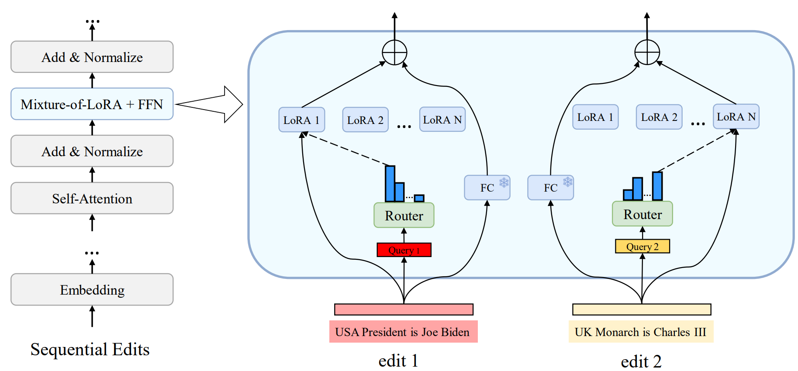

<!-- omit in toc -->
# ELDER: Enhancing Lifelong Model Editing with Mixture-of-LoRA
Official implementation of [ELDER: Enhancing Lifelong Model Editing with Mixture-of-LoRA](https://arxiv.org/pdf/2408.11869). This paper has been accepted by AAAI 2025.

<!-- omit in toc -->
## Requirements
### Installation
The experimental enviroment can be set by running: 
```
pip install -r requirements.txt
```
ELDER is integrated within [PEFT](https://github.com/huggingface/peft).
Use the following command to install our modified PEFT package.
  Detailed implementation of ELDER is in `./peft_egg/src/tuners/elder.py`.

```
cd peft_egg
pip install -e .
```
### Datasets
The zsRE and CounterFact datasets can be downloaded from [ROME](https://rome.baulab.info/data/dsets/). The datasets for evaluating the general abilities of language models are from [this work](https://jasonforjoy.github.io/Model-Editing-Hurt/).

## Run Experiments
Please use the the scripts of [MELO](https://github.com/ECNU-ICALK/MELO?tab=readme-ov-file) for running experiments.


## Acknowledgments
This repo benefits from [PEFT](https://github.com/huggingface/peft), [FastMoE](https://github.com/laekov/fastmoe), [MELO](https://github.com/ECNU-ICALK/MELO?tab=readme-ov-file) and [GRACE](https://github.com/Thartvigsen/GRACE). Thanks for their wonderful works.


## Reference
```
@misc{li2024elderenhancinglifelongmodel,
      title={ELDER: Enhancing Lifelong Model Editing with Mixture-of-LoRA},
      year={2024},
      archivePrefix={arXiv},
      url={https://arxiv.org/abs/2408.11869}, 
}
```
## Contact
If you have any questions, feel free to contact jali@mail.ustc.edu.cn.
